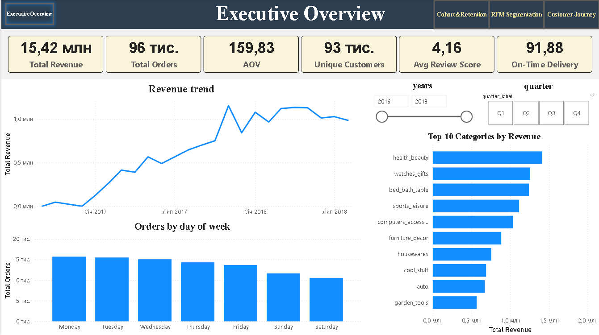
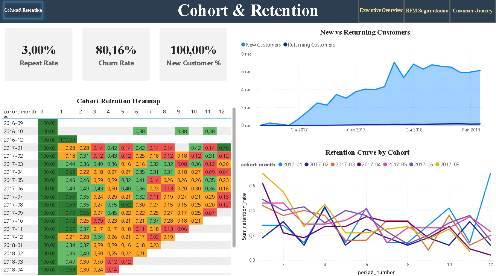
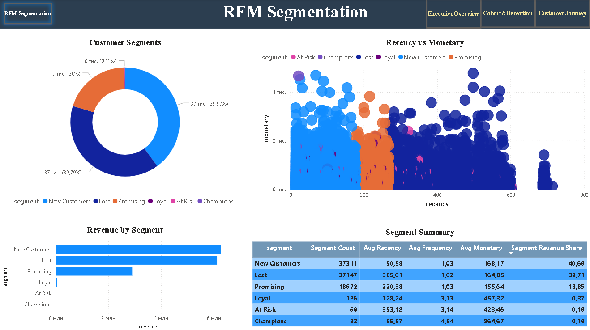
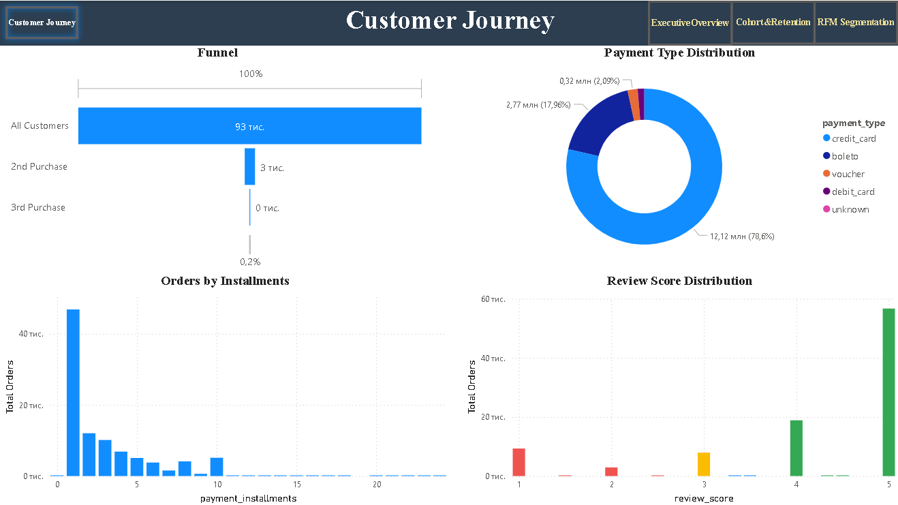

# 📊 E-Commerce Customer Retention Dashboard

Інтерактивний дашборд Power BI для аналізу утримання клієнтів, когортної поведінки та RFM-сегментації на реальних даних бразильського e-commerce (Olist, 100K+ замовлень, 2016–2018).

---

## 🖼️ Демо






---

## ✨ Основні можливості

- **Executive Overview** — 6 KPI-карток (Revenue, AOV, Orders, Customers, Review Score, On-Time Delivery), тренд доходу з ковзною середньою, топ-10 категорій, розподіл замовлень по днях тижня, інтерактивні фільтри по роках та кварталах.
- **Cohort & Retention** — когортна теплокарта з умовним форматуванням, криві утримання по когортах, динаміка нових vs повторних клієнтів, ключові метрики відтоку (Churn Rate, Repeat Rate).
- **RFM Segmentation** — сегментація клієнтів за моделлю Recency-Frequency-Monetary (Champions, Loyal, At Risk, Lost та ін.), scatter-діаграма, зведена таблиця по сегментах, розподіл доходу.
- **Customer Journey** — воронка покупок (1-ша → 2-га → 3-тя покупка), аналіз типів оплати, розподіл розстрочок, гістограма відгуків з умовним форматуванням.

---

## 🛠️ Технології

|      Рівень       |       Технологія        |
|-------------------|-------------------------|
| ETL               | Python 3, Pandas, NumPy |
| Візуалізація      | Power BI Desktop        |
| Моделювання даних | Star Schema, DAX        |
| Контроль версій   | Git, GitHub             |

---

## 🏗️ Як реалізовано

Сирі дані (8 CSV-файлів з Kaggle) обробляються Python-скриптом `olist_etl.py`, який виконує очищення, зʼєднання таблиць, розрахунок когорт та RFM-сегментацію. На виході — 4 підготовлені CSV-таблиці у форматі star schema (fact_orders, cohort_data, rfm_data, dim_date). Ці таблиці імпортуються у Power BI, де побудовано модель даних, 25+ DAX-мір та 4 інтерактивні сторінки дашборду.

---

## 🚀 Встановлення

### Передумови
- [Python 3.10+](https://www.python.org/downloads/)
- [Power BI Desktop](https://powerbi.microsoft.com/desktop/) (безкоштовна версія)

### Крок 1 — Клонування репозиторію

```bash
git clone https://github.com/GOS81/ecommerce-retention-dashboard.git
cd ecommerce-retention-dashboard
pip install pandas numpy
```

### Крок 2 — Завантаження даних

Використайте готові айли з папки `./output/` 
або
Завантажте [Brazilian E-Commerce Dataset](https://www.kaggle.com/datasets/olistbr/brazilian-ecommerce) з Kaggle.

### Крок 3 — Запуск ETL (якщо використовуєте сирі данні з Kaggle)

```bash
python olist_etl.py
```

У папці `./output/` зʼявляться 4 підготовлені CSV-файли.

### Крок 4 — Відкрити дашборд

Відкрийте `olist-customer-retention-analysis.pbix` у Power BI Desktop.

Якщо будуєте з нуля — імпортуйте CSV з `./output/`, додайте міри з `dax_measures.dax` та створіть таблицю `Funnel_Steps` (деталі у файлі мір).

---

## 📖 Використання

Дашборд складається з 4 сторінок з навігацією через кнопки у хедері:

- **Overview** — загальна картина бізнесу. Використовуйте слайсери року та кварталу для фільтрації.
- **Cohorts** — клікніть на рядок у теплокарті, щоб побачити деталі конкретної когорти.
- **RFM** — клікніть на сегмент у кільцевій діаграмі — всі візуали відфільтруються крос-фільтрацією.
- **Journey** — воронка показує drop-off між покупками; гістограми деталізують платіжну поведінку.

---

## 📁 Структура проєкту

```
ecommerce-retention-dashboard/
├── olist_etl.py          # Python-скрипт підготовки даних
├── dax_measures.dax      # DAX-міри з поясненнями
├── README.md             # Документація (English)
├── README_UKR.md         # Документація (Українська)
├── data/                 # Сирі CSV з Kaggle
├── output/               # Підготовлені CSV для Power BI
├── dashboard/            # Файл Power BI (.pbix)
└── screenshots/          # Скріншоти сторінок дашборду
```

---

## 👤 Автор

**Олександр Голубчик** — Data Analyst

- LinkedIn: [linkedin.com/in/oleksandrgolubchyk](https://www.linkedin.com/in/oleksandrgolubchyk/)
- GitHub: [github.com/GOS81](https://github.com/GOS81)
- Email: a_golubchyk@ukr.net
